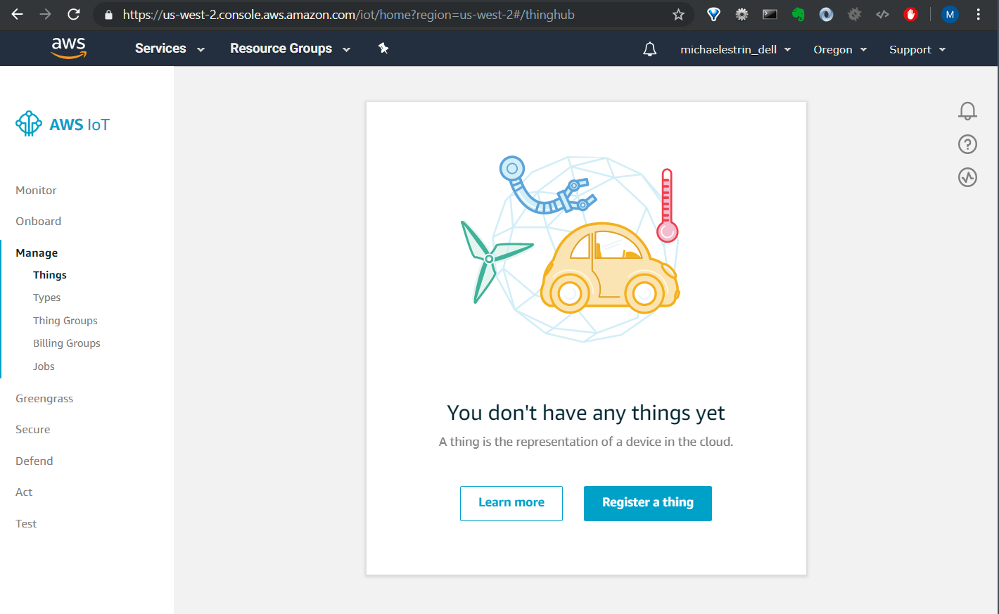
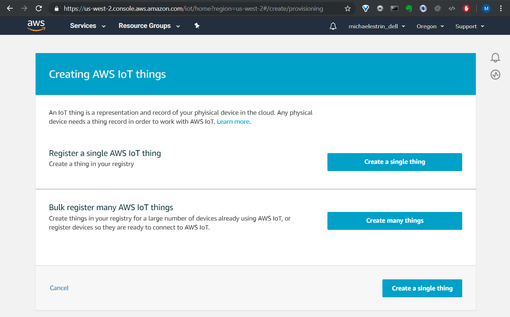
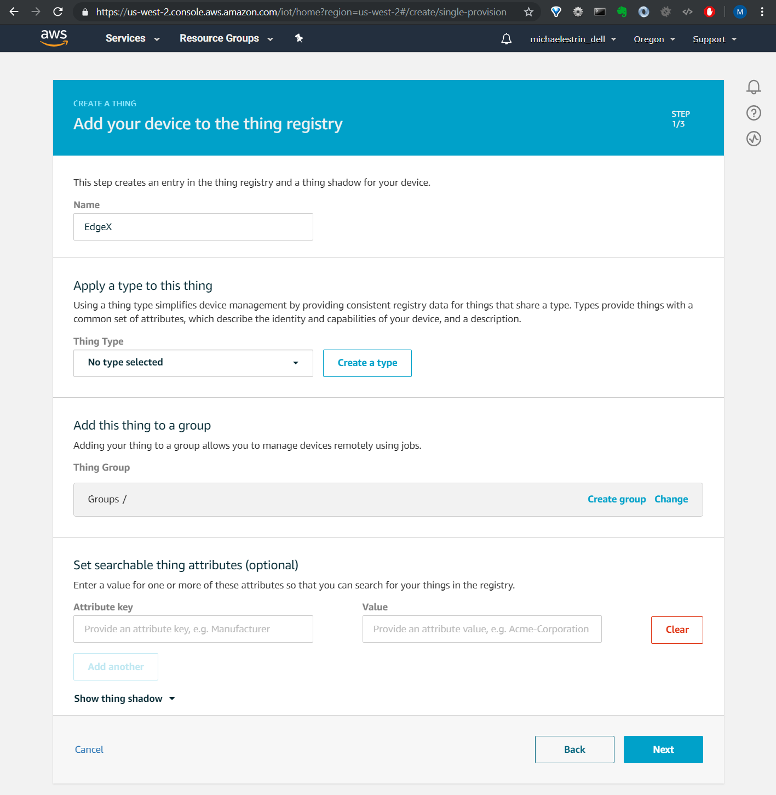
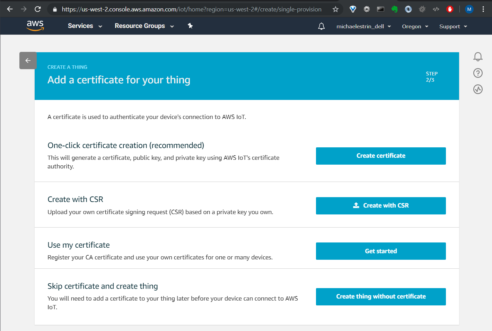
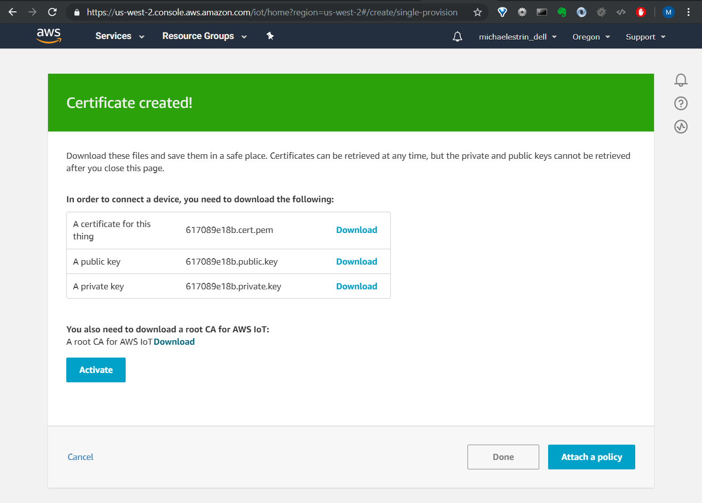
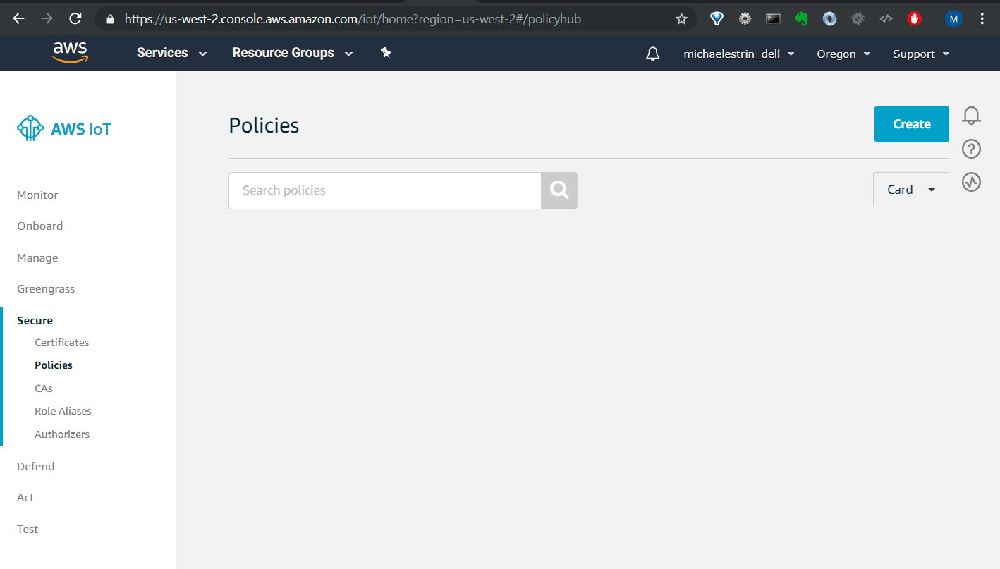
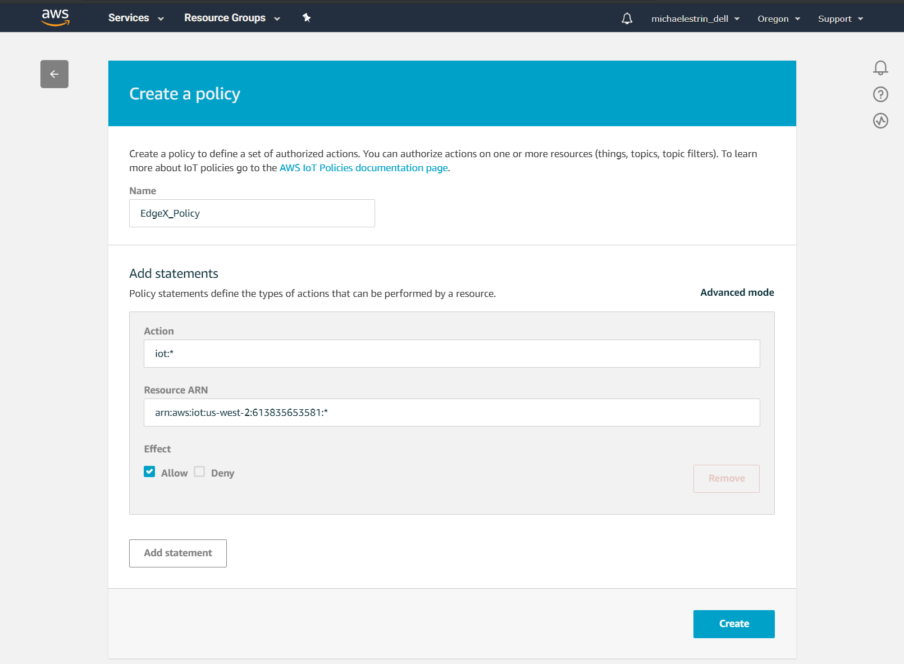
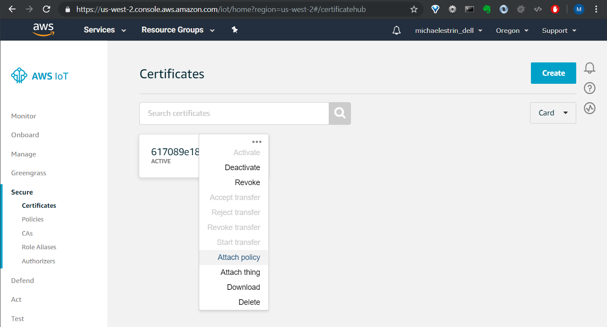
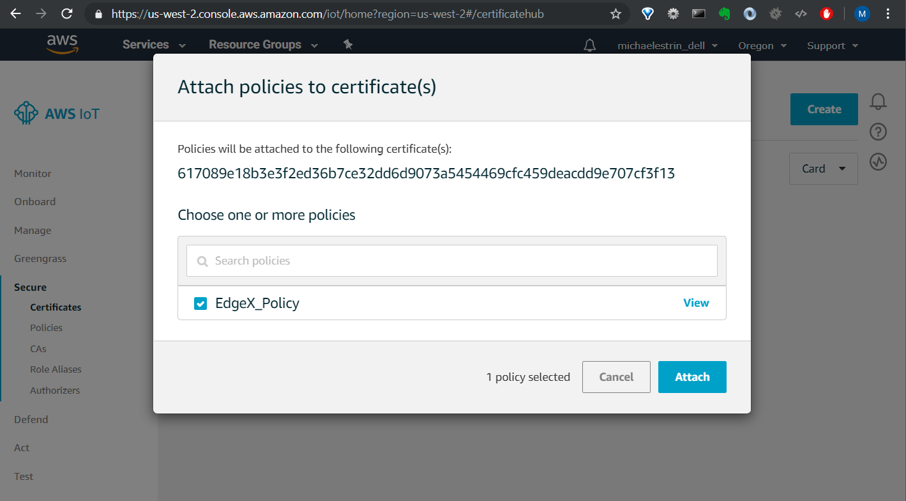
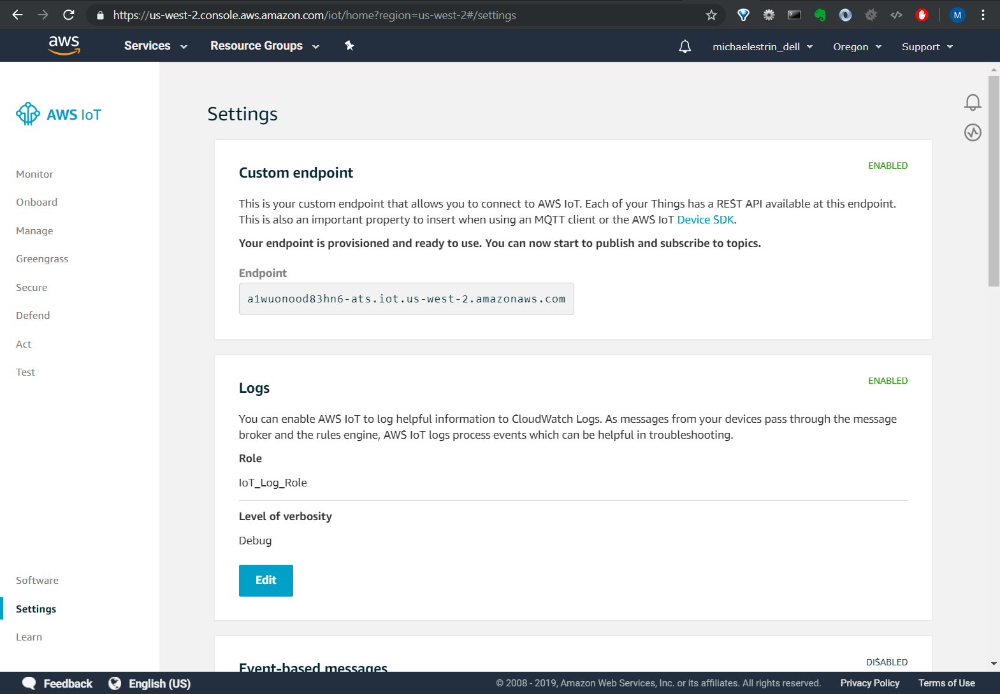

# michaelestrin/cloudmqtt/docs/aws -- Connecting to AWS IoT

I was able to connect the service to AWS IoT as follows.

First, in the AWS IoT console, I selected the __Register a thing__ option:

I then selected the __Create a single thing__ option:

In the subsequent screen, I then selected the __Create a single thing__ option:

I then gave it a name and selected the __Next__ option:

I then selected the __Create certification__ option for one-click certificate creation:

Once the certificates were generated, I downloaded the certificate and keys.  I then activated the certificate by 
    selecting the __Activate__ option:
    
    

Once the certificate was activated, I selected the __Done__ option:

I then created a new security policy by selecting the __Create__ option:

I then named the policy, gave it _iot:*_ action permissions, checked the __Effect:Allow__ checkbox, and selected the 
    __Create__ option:
    

I then attached the policy to the certificate I created in an earlier step:

I then found my custom endpoint for connecting to the AWS IoT MQTT service:

Finally, I modified my `configuration.toml` file to reference the certificate, the private key, and to incorporate 
    the custom endpoint:
    
