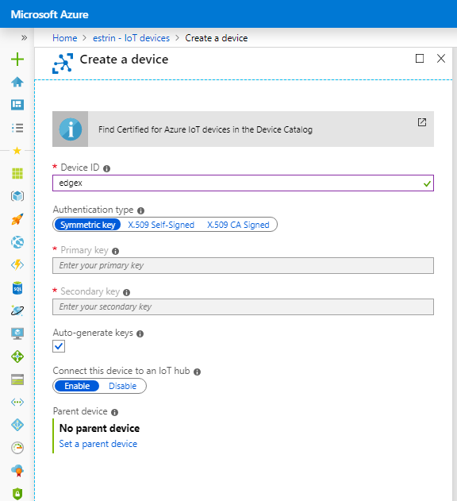
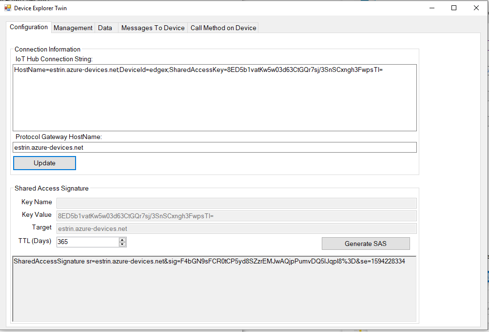
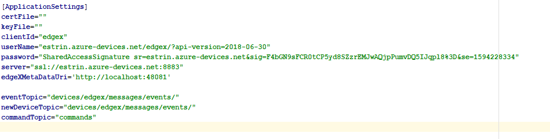

# michaelestrin/cloudmqtt/docs/azure -- Connecting to Azure IoT Hub

I was able to connect the service to Azure IoT Hub using symmetric key authentication.  I first created a new device in 
    Azure IoT Hub as follows:

I then edited the newly created device to obtain a connection string:

I then used the Azure IoT Hub [Device Explorer App](images/https://github.com/Azure/azure-iot-sdk-csharp/tree/master/tools/DeviceExplorer) 
    to generate a shared access signature from the connection string:
    

I then copied the resulting shared access signature string into my configuration.toml's password field:

Some additional notes:

* ​clientId should be the newly created [deviceName].  
* userName should be "[Azure IoT Hub host name]/[deviceName]/?api-version=2018-06-30"
* server should be "ssl://[Azure IoT Hub host name]:8883"
* eventTopic and newDeviceTopic should be "devices/[deviceName]/messages/events/"